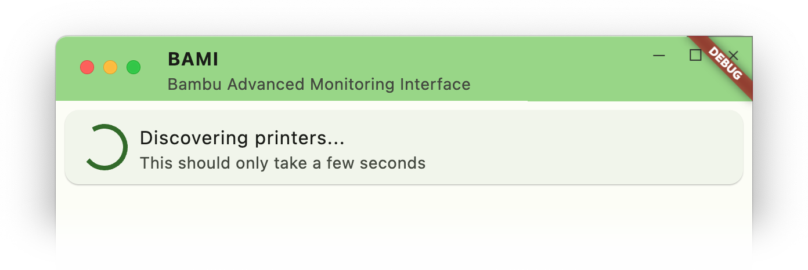

An alternative for the Bambu Handy app. Their app requires to put your printer in *Cloud Mode*, is only available for Android and iOS, and it closed source. This app has some of the same functionality, but none of the downsides.

More information in Dutch: https://forum.revspace.nl/t/bami-bambu-advanced-monitoring-interface/253

Planned features:
* [x] Device discovery
  * [ ] Device discovery on Apple's platforms with weird permission requirements
* [x] Progress of currently running prints
* [ ] Pausing and stopping prints
* [x] Live video from built-in camera
  * [ ] more reliable than Bambu's own live view
* [ ] Notifications on starting/stopping/failing of prints
* [ ] 3D gcode preview with progress indication
* Fitting UI for all platforms:
  * [ ] Desktop
  * [ ] Mobile
  * [ ] TV

Supported devices
* Android phones and tablets
* <del>Android</del><ins>Google</ins> TV (with a UI focused on live view)
* iPhone, iPad, iPod Touch
* Linux Desktop
* macOS Desktop
* Windows Desktop
* Linux Mobile (Pinephone, etc)

I'm considering distribution via Google Play, Fdroid, Flathub, and also on the [releases page](https://github.com/Peetz0r/bami/releases).

Availability on the Apple App Store depends on how they will be implementing the [DMA](https://en.wikipedia.org/wiki/Digital_Markets_Act). With their current proposition they might not be meeting the [EC](https://en.wikipedia.org/wiki/European_Commission)'s wishes. We shall see what happens in the (hopefully near) future.
